# Seal

**Put a one-use approval gate in front of the MCP tools that can hurt you.**

Seal runs locally between Claude Code and one stdio MCP server. Calls to the
tools you select stop before execution. You see the exact tool and arguments,
accept or decline them, and Seal refuses reuse of the same approval.

> **One exact call. One approval. One use.**

**Requires Node 20+. [Source builds](docs/start/install.md) have CI compatibility evidence on Linux x86-64 and macOS x64/arm64 for build, install, demo, and receipt check; the published Seal v0.2.0-rc.2 asset is Linux x86-64. Protect also requires Claude Code's `claude` command.** Check that it is available with `claude --version` before Protect. On macOS x64/arm64, the published-asset limitation lifts when you build and install from source by the linked procedure. It never lifts for Windows or Linux ARM in this release; use a supported Linux x86-64 or macOS x64/arm64 host instead.

[](https://raw.githubusercontent.com/velvetmonkey/seal/main/assets/seal-flow.svg)

[](https://github.com/velvetmonkey/seal/actions/workflows/ci.yml) · Apache-2.0. See [LICENSE](LICENSE).

## See it work

Run the local demo and accept when it asks:

```bash
seal demo
```

This is the start of a real run from a build of this checkout. The rest of the
same unedited capture appears under [The boundary](#the-boundary).

<!-- Seal demo transcript -->
```text
seal demo — one shared proxy, one hidden child, one real file
tool      demo.mutate  guarded
child     seal __demo-server (this same binary) mutating /tmp/seal-demo-59gSrW/child/data.txt
temporary demo directory: /tmp/seal-demo-59gSrW (remains after the demo for the printed checker command)
child calls observed: 0 (read from /tmp/seal-demo-59gSrW/child/data.txt.count)
INPUT REQUIRED  the proxy holds this call's approval; the contract's message:
    Approval required
    Tool: demo.mutate
    Arguments:
      line: "seal demo wrote this line"
    Scope: this parsed call (key order and 1/1.0 match); at most one run; 2 min.
    Outside Seal: Bash, network, subprocesses, other tools and servers.
child calls observed: still 0 (read from /tmp/seal-demo-59gSrW/child/data.txt.count) — approval shown, nothing executed

child calls observed: 1 (read from /tmp/seal-demo-59gSrW/child/data.txt.count)
replaying the identical retry with the same requestState…
BLOCKED   the shared proxy refused the replay: "approval refused: already_consumed — this one-use approval has already been consumed"
one-use held: the replay did not run the call again; child calls observed: still 1 (read from /tmp/seal-demo-59gSrW/child/data.txt.count)
```

After checking the receipt, remove the exact temporary demo directory printed for your run with `rm -r`. The published release keeps this immutable installed-tree identity:

<!-- Seal installed-tree pin role: published-asset -->
```output
installed seal 0.2.0-rc.2 linux-x64
store: /home/monkey/.local/lib/seal/store/8531e01f662dcd4168b06dbbe101dab3b012d6e28498286bece3e42688dbb0c3
command: /home/monkey/.local/bin/seal
tree: 8531e01f662dcd4168b06dbbe101dab3b012d6e28498286bece3e42688dbb0c3
```

## Protect something real

In a [Claude Code project](docs/guide/choosing-what-to-protect.md) whose `.mcp.json` already defines a stdio server named
`db`, protect two tools as one complete set:

```bash
seal protect db demo.mutate demo.erase
```

```output
Project .mcp.json hash before protect: 5039c5ce68ad23ecd2e30b6bac49869b2aadd1b0ba6109d68346913395916135
Protection: PENDING RESTART db.{demo.mutate, demo.erase}
Protection scope: 0 other tools NOT APPROVAL-GATED (they pass through Seal)
State: /home/monkey/scratch/readmerewrite-run/protect-home/.local/share/seal/projects/a369c28e11ee17f08a8727779506f639/state.json
Next:
  1. Restart Claude Code in this project.
  2. Run `seal status`.
  3. Look for `Protection: ACTIVE`.
Undo:
  Stop Claude Code, then run `seal unprotect db`.
```

Exit code: `0`.

Protection is declared once as the complete set for that server; it is not
additive. Seal checks that both names exist, asks Claude Code to install a local
override, and leaves `.mcp.json` unchanged. Protect ends at `PENDING RESTART`;
inspect the [stored state](docs/guide/what-is-protected-right-now.md) before restarting Claude Code:

```bash
seal status
```

```output
Runtime: present seal-assurance-kit@962823b22d179f3354f8b8cf1a7091029a23c715
Protection: PENDING RESTART db.{demo.mutate, demo.erase} (/home/monkey/scratch/readmerewrite-run/protect-home/.local/share/seal/projects/a369c28e11ee17f08a8727779506f639/state.json)
Next:
  1. Restart Claude Code in this project.
  2. Run `seal status`.
  3. Look for `Protection: ACTIVE`.
Undo:
  Stop Claude Code, then run `seal unprotect db`.
Receipts: 0 stored in /home/monkey/scratch/readmerewrite-run/protect-home/.local/share/seal/projects/a369c28e11ee17f08a8727779506f639/receipts
Most recent: no receipt yet (receipt directory has no files; no decision has been recorded)
```

Exit code: `0`.

Seal runs locally between Claude Code and one stdio MCP server. Calls to the
tools you select stop before execution. You see the exact tool and arguments,
approve or decline them, and Seal refuses reuse of the same approval.
`protect` hashes the server entry and discovers its tools before recording protection; a vanished tool at activation makes the state `BROKEN`. Claude Code writes `~/.claude.json` and a backup under `~/.claude/backups/` while installing the override; Seal invokes Claude Code but does not write either file.

## Remove it

Stop Claude Code, then run this in the protected project:

```bash
seal unprotect db
```

```output
Project .mcp.json hash before unprotect: 5039c5ce68ad23ecd2e30b6bac49869b2aadd1b0ba6109d68346913395916135
Project .mcp.json hash after unprotect: 5039c5ce68ad23ecd2e30b6bac49869b2aadd1b0ba6109d68346913395916135
Protection: - outside Seal
Next:
  1. Run `seal status`.
  2. Look for `Protection: - outside Seal`.
Undo:
  Run `seal protect db demo.mutate demo.erase`.
```

Exit code: `0`.

Unprotect asks Claude Code to remove only Seal's local override. It does not delete Claude Code's `~/.claude.json` or backups under `~/.claude/backups/`; those files remain. They cease to remain only if you or Claude Code separately remove those exact files; Unprotect itself never removes them.

The project `.mcp.json` stays byte-for-byte unchanged.

## The boundary
Seal controls calls that pass through the protected MCP server path.
It does not control Bash, direct file writes, network access, subprocesses,
other MCP servers, or another route to the same effect.
Seal is a gate, not a sandbox.
<!-- Seal demo transcript -->
```text
receipt written: /tmp/seal-demo-59gSrW/receipts/receipt-1787445514091-1067984-0001-INPUT_REQUIRED.json
receipt written: /tmp/seal-demo-59gSrW/receipts/receipt-1787445514561-1067984-0002-ALLOW.json
receipt written: /tmp/seal-demo-59gSrW/receipts/receipt-1787445514564-1067984-0003-BLOCK.json

SCOPE WITNESS

Seal controlled this path:
  demo client -> Seal -> demo MCP server -> demo.mutate

If a route to the same effect does not pass through the printed Seal path, Seal did not control it.

Now the demo performs a harmless direct local write
that does not cross the Seal gate.

DIRECT WRITE SUCCEEDED
Seal decisions emitted: 0 (receipts in /tmp/seal-demo-59gSrW/receipts: 3 before the write, 3 after)
```
<!-- Seal installed-tree pin role: published-asset -->
```text
  node "/home/monkey/scratch/docsland-reader-walk-run/home/.local/lib/seal/store/8531e01f662dcd4168b06dbbe101dab3b012d6e28498286bece3e42688dbb0c3/checker/seal-receipt-check.mjs" "/home/monkey/scratch/docsland-reader-walk-run/tmp/seal-demo-aJvvA2/receipts/receipt-1786793452633-3115472-0003-BLOCK.json" --pubkey "/home/monkey/scratch/docsland-reader-walk-run/tmp/seal-demo-aJvvA2/receipt-signer.pub"
```
<!-- Seal demo transcript -->
```text

Seal is a gate, not a sandbox: it controls the path through it, and only that path.
summary: approval matched the effect, one child call observed, replay refused; 3 receipts written; one write happened outside Seal.
receipts are claims, not proofs. Check one with the separate-process checker (V11-RECEIPT-01). It imports no Seal module at check time, but carries a byte-identical copy of Seal's canonicalisation rule and uses the same Node crypto platform. It can detect a changed canonical parsed value against your trusted key; semantically irrelevant JSON formatting differences are not distinguished. It cannot detect a defect shared by that rule or platform. It ships in this same artifact, so it also cannot protect against a replaced artifact:
  node "/home/monkey/scratch/seal/checker/seal-receipt-check.mjs" "/home/monkey/scratch/runner-temp/tty-demo/receipts/receipt-1787135578553-2349212-0003-BLOCK.json" --pubkey "/home/monkey/scratch/runner-temp/tty-demo/receipt-signer.pub"
  Note: that key is the very one this demo used to sign the receipt, so checking against it proves only self-consistency — a hostile sealer could sign its own. To prove anything, supply a key you obtained from a source you already trust.
  Online: https://velvetmonkey.github.io/seal-check/ re-checks a decision receipt you paste in your browser and reports its receipt checks; no backend, accounts, or telemetry. It does not establish that this setup routes calls through Seal, and it is not the checker command above.
```

Exit code: `0`.

The [published-asset checker line](docs/start/install.md) between the capture pieces is retained at its
immutable pin. A fresh source build instead prints `seal-receipt-check.mjs` as a
separate release asset; the quoted-output guard reports that inherited drift.
The landing page has **zero `<button>` controls**. See [seal-check](https://velvetmonkey.github.io/seal-check/).
For the checker caveats in the captured output above, the JSON-formatting limit never lifts because the checker verifies canonical parsed values; compare the receipt bytes with a trusted byte-for-byte copy if formatting itself matters. The shared-rule and shared-platform limit lifts only with a checker that separately implements canonicalisation and uses a separate crypto implementation. The replaced-artifact limit lifts only when the checker is obtained and authenticated through a trust path separate from the Seal artifact it checks.
The online checker can never establish routing from a receipt because it sees no call path. Establish routing separately: require `seal status` to report `ACTIVE`, then observe the protected call stop at Seal's exact-tool approval prompt before the server effect.
At the exact release tag, your build writes `seal-v0.2.0-rc.2-linux-x64` in your own `dist/` directory; see [distribution details](docs/assurance/distribution.md).

```text
seal-v0.2.0-rc.2-linux-x64
```

- Protect mediates one stdio MCP server entry. Only the selected tools are
  approval-gated; unselected tools still pass through Seal's forwarding checks.
- One approval covers the displayed call. A failure before forwarding can spend
  it without running the call. Seal trusts Claude Code to present the choice to a
  human and cannot distinguish a human click from an automatic elicitation hook.
  Expiry follows the local wall clock; there is no trusted-time guarantee.
  The spent-before-forwarding limit never lifts for that approval because Seal
  consumes it durably before forwarding; after confirming no server effect,
  submit a fresh call for a fresh approval. Human-origin assurance would lift
  only if the client response supplied Seal a verifiable human-origin signal,
  which the shipped protocol does not. Trusted-time assurance would lift only
  if Seal's expiry input came from a trusted time source, which the shipped CLI
  does not support.
- The state machine is TESTED for the SINGLE-TOOL case only. In that case,
  Seal is TESTED to bind AUTHORIZATION, not INTENT. Multi-tool coverage reaches
  `PENDING RESTART` and `ACTIVE`; four state classes remain uncovered. That
  coverage limitation lifts when multi-tool tests also exercise `UNPROTECTED`,
  `STALE`, `DRIFTED`, and `BROKEN`.
- Receipts are signed records, not evidence that an event happened. Checking is
  only as good as the public key supplied. The demo key is new for each run; the
  protected path keeps a machine-local key. The optional checking path fetches a
  separately pinned runtime from GitHub, so it inherits that repository and
  byte-integrity boundary. The event-evidence limitation never lifts for a
  receipt alone because an `ALLOW` receipt is emitted before forwarding; use an
  server-side observation made separately from Seal as event evidence.
- The installed command is in a user-writable prefix and can be replaced by
  another process running as that user. The packaged store is read-only and
  integrity-checked; the entry point is not. This limitation lifts only when the
  installed command and every path component used to resolve it are not writable
  by that user and invocation is pinned to that protected path.
- Protect delegates its override to Claude Code, whose configuration and backups remain after Unprotect.

## Links

Release identity used by the install guide:

```text
SEAL_VERSION=v0.2.0-rc.2
./"$expected_name" --sha256 "$expected_digest" --bytes "$expected_bytes" --prefix ~/.local
```
- [Install or build Seal](docs/start/install.md)
- [Choose what to protect](docs/guide/choosing-what-to-protect.md)
- [Know whether it worked](docs/guide/knowing-it-worked.md)
- [Refusal codes and the documentation index](docs/assurance/README.md)
