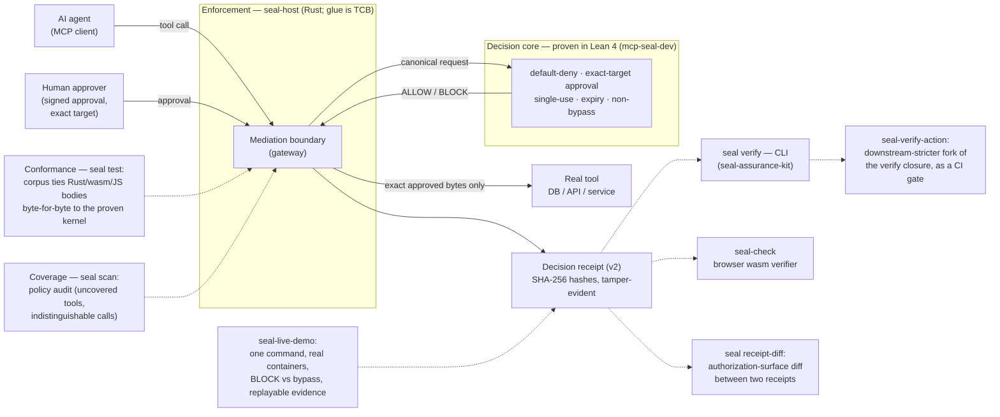

> Scope: This document describes the Seal family product, not the Node CLI shipped by this repository.
> The authorization rule is PROVED. The state machine is TESTED.
> For the truth about what you installed, read [docs/RELEASE-NOTES-v0.1.1.md](RELEASE-NOTES-v0.1.1.md) and the [README](../README.md).

# Seal family architecture — one picture

One diagram, five roles: **decision core** (proven), **enforcement** (deployed), **receipt**
(evidence), **conformance** (ties bodies to the proof), **coverage** (audits the policy).
Solid arrows are the runtime path; dashed arrows are evidence and audit paths.

## What each box is (and what it is not)

- **Decision core** (`mcp-seal-dev`) — the rulebook. Machine-checked Lean 4 theorems: default
  deny, allow **iff** a live approval record matches the exact target, single-use, expiry,
  non-bypass. Proven — but a *kernel* claim, not a whole-system claim; that the record was
  minted by the human you think is a custody assumption (truth box), not a theorem.
- **Enforcement** (`seal-host`) — the guard at the door. The Rust MCP host that routes every
  guarded call through the kernel and forwards only the exact approved bytes. The Rust glue is
  **TCB** (trusted, not proven); it is tied to the proof by conformance testing.
- **Receipt** — every decision emits a v2 receipt (normative spec:
  the host's [authorization decision schema](https://github.com/velvetmonkey/seal-host/blob/main/docs/AUTHORIZATION-DECISION-SCHEMA.md) §11) with derived SHA-256 hashes. Tamper-**evident**,
  not tamper-impossible. Two independent checkers: `seal verify` (CLI) and `seal-check` (browser).
- **Conformance** (`seal test`, conformance bridge) — finite, rerunnable evidence that the
  deployed bodies (Rust, wasm, JS) agree with the proven kernel byte-for-byte over a corpus.
  Evidence, not a universal theorem.
- **Coverage** (`seal scan`) — audits a policy against a tool inventory: uncovered tools,
  redundant rules, calls the policy cannot distinguish.
- **Drift** (`seal receipt-diff`) — field-level diff between two receipts, every difference
  classified authorization-surface vs minor, integrity-checked against each receipt's own
  hashes before diffing. Reports change; it does not re-verify a seal.
- **CI gate** (`seal-verify-action`) — the `seal verify` closure vendored into a GitHub
  Action as a maintained downstream-stricter fork of the kit verifier (base kit revision
  pinned, every vendored file sha256-checked in CI; the fork additionally requires a valid
  `signed_config` for an authorised outcome — see seal-verify-action/VENDORED.md): receipts
  are re-verified on every push and an unverifiable receipt fails the build.
- **Sufficiency** (`seal adequacy`) — the prior question: do the committed fields carry enough
  information to identify the effect they authorize? A found collision indicts the field set
  itself — no implementation reading those fields can fix it. This check caught Seal's own
  pre-v2 approval surface; v2's `args_hash` closes it.

Claim-status per box: [CLAIMS-MATRIX.md](CLAIMS-MATRIX.md). Honesty boundary:
[What Seal is NOT](https://github.com/velvetmonkey/seal-assurance-kit/blob/main/docs/WHAT-SEAL-IS-NOT.md).
Fleet links are public and resolve for everyone; `witness-check` remains proprietary.

## Shipped Node bridge

The shipped Node CLI keeps continuation state in Node and sends only the
authorization sub-question through the vendored WASM. A guarded retry follows
`spine/proxy.cjs` → `contract/contract.cjs` →
`contract/kernel-authorization.cjs` →
`runtime/kernel/runner.cjs` → `seal_decide`. The WASM
answer is load-bearing: BLOCK, unreadable output, a hash mismatch, or a
Node/kernel disagreement all refuse, with no JavaScript authorization fallback.

Node still owns opaque-handle lookup, status and expiry, connection-epoch
currency, the `inputResponses` protocol shape, and journal-before-forward
one-use consumption. The kernel answers exact tool, canonical arguments,
issue-time project/server binding as supplied by Node, and the affirmative
acceptance translated to its target commitment. Therefore the accurate product
claim is exactly: The authorization rule is PROVED. The state machine is TESTED.

The working Node loader does not use `seal-config.js`'s hard-coded `demo-pk`
stub envelope. It generates an Ed25519 key inside the kernel worker and signs
the config immediately before `seal_init`. That gets the real kernel onto the
product path without weakening signature verification, but it is still
demo-grade, self-authorized configuration signing—not an externally trusted
production configuration key.
