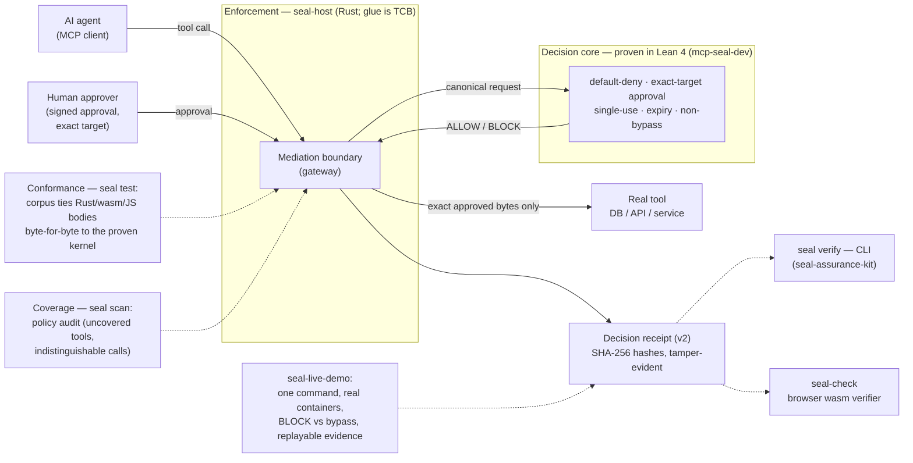

# Seal family architecture — one picture

One diagram, five roles: **decision core** (proven), **enforcement** (deployed), **receipt**
(evidence), **conformance** (ties bodies to the proof), **coverage** (audits the policy).
Solid arrows are the runtime path; dashed arrows are evidence and audit paths.

## What each box is (and what it is not)

- **Decision core** (`mcp-seal-dev`) — the rulebook. Machine-checked Lean 4 theorems: default
  deny, allow **iff** a live human approval matches the exact target, single-use, expiry,
  non-bypass. Proven — but a *kernel* claim, not a whole-system claim.
- **Enforcement** (`seal-host`) — the guard at the door. The Rust MCP host that routes every
  guarded call through the kernel and forwards only the exact approved bytes. The Rust glue is
  **TCB** (trusted, not proven); it is tied to the proof by conformance testing.
- **Receipt** — every decision emits a v2 receipt (normative spec:
  `seal-host/docs/DECISION-RECEIPT-SCHEMA.md` §11) with derived SHA-256 hashes. Tamper-**evident**,
  not tamper-impossible. Two independent checkers: `seal verify` (CLI) and `seal-check` (browser).
- **Conformance** (`seal test`, conformance bridge) — finite, rerunnable evidence that the
  deployed bodies (Rust, wasm, JS) agree with the proven kernel byte-for-byte over a corpus.
  Evidence, not a universal theorem.
- **Coverage** (`seal scan`) — audits a policy against a tool inventory: uncovered tools,
  redundant rules, calls the policy cannot distinguish.
- **Sufficiency** (`seal adequacy`) — the prior question: do the committed fields carry enough
  information to identify the effect they authorize? A found collision indicts the field set
  itself — no implementation reading those fields can fix it. This check caught Seal's own
  pre-v2 approval surface; v2's `args_hash` closes it.

Claim-status per box: [CLAIMS-MATRIX.md](CLAIMS-MATRIX.md). Honesty boundary:
[What Seal is NOT](https://github.com/velvetmonkey/seal-assurance-kit/blob/main/docs/WHAT-SEAL-IS-NOT.md).
Family links are private; they resolve only for authorised evaluators.
