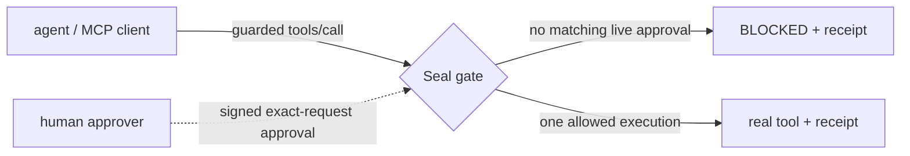

# Front-page reference

This page holds the evaluator, research, and alternate-demo detail moved from
the front page. The README is now the developer door; nothing below is a second
getting-started path.

## What Seal does

Seal mediates guarded effects and records every decision. A guarded MCP
`tools/call` reaches the real tool only when the exact target has a matching
live approval record; explicitly listed safe calls can be allowed by policy,
and everything else is denied by default. Each decision emits a receipt and a
hash-chain record so a later verifier can re-derive whether the effect was
authorized.

Seal does not need a model to understand why a request is dangerous. It checks
whether the exact effect was authorized. That a record was minted by the human
you intended is a key-custody assumption, not a theorem.

## What is proven, tested, assumed, and not claimed

The decision rule is machine-checked in Lean 4. The deployed Rust, wasm, and
JavaScript bodies are connected to that rule by byte-exact tests over a finite
conformance corpus, not by an end-to-end theorem.

Effect-commitment sufficiency is **tested, never claimed as proven**. The
pre-v2 field set admitted a concrete collision: two different effects were
indistinguishable through the committed fields. V2's `args_hash` closes that
measured hole. `seal adequacy` exposes the finite check; `witness-check`, the
other sufficiency analyzer, is private and proprietary.

The complete status of every claim is in the [claims matrix](CLAIMS-MATRIX.md).
The mandatory non-claims remain canonical in [limitations](LIMITATIONS.md):
Seal proves kernel properties, not the whole deployed system; assumes SHA-256
collision resistance; does not prove its Rust/wasm/JavaScript glue bug-free;
guarantees authorization match rather than intent match; does not prevent
compromised hosts, browsers, build systems, keys, operators, or downstream
tools; provides tamper-evidence rather than tamper-impossibility; and does not
make an AI smarter or prevent hallucinations. The axiom-footprint ceiling is
scoped to the theorem names pinned by the family gates, not the entire
repository.

The deployed profile is `compatible`. Strict `canonical-l0` is proved and
modelled but is not the deployed route. Host `ApprovalRecord` tokens are a
separate signed channel from the v2 kernel tuple. “Canonical” means the pinned
Seal byte rule, not RFC 8785/JCS. Read the full [truth box](TRUTH-BOX.md) and
[evaluator map](../EVALUATOR-START.md) before making a deployment claim.

## Receipts and assurance tools

Each tool answers one question:

| Question | Tool |
|---|---|
| Is a receipt well-formed, canonical, and re-derivable? | `seal verify` in `seal-assurance-kit` |
| Does the field set carry enough information for its claim? | `seal adequacy`; proprietary `witness-check` provides the private analyzer surface |
| Did a change touch what was authorized? | `seal receipt-diff` |
| Should unverifiable receipts fail CI? | `seal-verify-action` |

The standalone fixture-verification exercise formerly called “first receipt
in 60 seconds” is documented by the
[assurance kit](https://github.com/velvetmonkey/seal-assurance-kit). It is a
receipt exercise, not the product's canonical first-run journey.

## Scripted attack replay

The separate [live demo](https://github.com/velvetmonkey/seal-live-demo)
replays a scripted destructive request through containers, shows it blocked,
then shows the byte-identical request destroy the disposable database when the
gate is bypassed. The request is scripted and is not emitted by a live model.
Its own documentation names Docker, Node, the expected assertions, real row
counts, and the receipt-verification routes. It is an attack replay, not a
second onboarding path.

## Fleet and distributed results

Seal proves a coordination-free lower bound: disconnected replicas cannot
both preserve availability and prevent double-spending the same one-shot
authority. In the gate model, a shared replay store alone does not supply the
seal; single-delivery and mesh-coordinated shapes are safe in their stated
models. The transfer is scoped to the approval TTL and concurrent replicas.

Published releases: **0**. No gate is shipped as a release. Coordinated mesh
deployment is a separate architecture, not a feature implied by the repository. Read the
[authorization mesh](AUTHORIZATION-MESH.md) for the necessity theorem,
finite-model sufficiency results, third safe shape, and all scope limits.

## Repository map

| Repository | Role |
|---|---|
| [mcp-seal-dev](https://github.com/velvetmonkey/mcp-seal-dev) | Machine-checked decision rule |
| [crdt-lean](https://github.com/velvetmonkey/crdt-lean) | Distributed lower bound and safe-shape models |
| [seal-host](https://github.com/velvetmonkey/seal-host) | Deployed MCP effect-boundary gate |
| [seal-check](https://github.com/velvetmonkey/seal-check) | Browser and CLI receipt replay |
| [seal-live-demo](https://github.com/velvetmonkey/seal-live-demo) | Scripted production-path attack replay |
| [seal-assurance-kit](https://github.com/velvetmonkey/seal-assurance-kit) | Receipt, conformance, adequacy, and diff tools |
| [witness-check](https://github.com/velvetmonkey/witness-check) | Private/proprietary sufficiency analyzer |
| [seal-verify-action](https://github.com/velvetmonkey/seal-verify-action) | Receipt verification in GitHub Actions |

Auditors should continue with the [evaluator start](../EVALUATOR-START.md),
[claims matrix](CLAIMS-MATRIX.md), [architecture](ARCHITECTURE.md), and
[limitations](LIMITATIONS.md). Researchers should start with `mcp-seal-dev`
and the [authorization mesh](AUTHORIZATION-MESH.md).

Buyers evaluating the product rather than the proof should start with the
single developer journey in the umbrella README, then use the
[scripted attack replay](#scripted-attack-replay) only as a separate
block-versus-bypass evaluation.

The before-and-after claim and caveat inventory is the
[README content map](README-CONTENT-MAP.md).
