# Seal documentation

## Contents

- [Start here](#start-here)
- [Use Seal day to day](#use-seal-day-to-day)
- [Look up exact behavior](#look-up-exact-behavior)
- [Audit the claims and evidence](#audit-the-claims-and-evidence)
- [Understand the repository-maintenance files](#understand-the-repository-maintenance-files)

Seal is a proxy that intercepts one MCP tool call, asks you to approve it, and refuses to replay it without a new approval.

If Seal refuses something, start with [the refusal-code guide](guide/when-something-looks-wrong.md): every refusal code in that reference is checked against the product source, in both directions.

## Start here

- [Install Seal](start/install.md) — How do I verify the release bytes, install them fail-closed, or build and install this checkout?
- [Walk a source-build receipt](start/evaluator-walk.md) — How do I inspect and tamper-check a demo receipt when the checker is outside the source-built installed store?

## Use Seal day to day

- [Choose your route through the operating guide](guide/README.md) — What should I read, in what order, before operating the gate for the first time?
- [Choose what to protect](guide/choosing-what-to-protect.md) — Which tools warrant approval, and what will protection change or deliberately leave alone?
- [See what is protected right now](guide/what-is-protected-right-now.md) — What do every `seal status` state, runtime line, receipt line, and `seal doctor` result mean?
- [Know whether the gate worked](guide/knowing-it-worked.md) — What should I observe in the prompt, demo, refusals, and signed receipts after a guarded call?
- [Recover when something looks wrong](guide/when-something-looks-wrong.md) — What caused a named refusal token, and what is the safe next action?
- [Check GitHub Actions provenance](guide/github-actions-provenance.md) — How do I verify which GitHub-hosted run and workflow produced the downloadable demo-receipt archive, and what does that provenance not establish?

## Look up exact behavior

- [Multi-tool protection semantics](reference/multi-tool-semantics.md) — Is protection additive or a declared set, how is shared state displayed, and which multi-tool states are actually exercised?

## Audit the claims and evidence

- [Assurance map](assurance/README.md) — Where do the shipped CLI documents end, and where do the wider family and historical records begin?
- [Release evidence](assurance/RELEASE-NOTES-v0.2.0-rc.2.md) — What does v0.2.0-rc.2 contain, exclude, and cite as evidence for each release claim?
- [Architecture](assurance/architecture.md) — Which decisions stay in Node, which exact-call question reaches the pinned WASM, and how does that shipped path differ from the wider Seal family?
- [Claude Code evidence](assurance/claude-code-evidence.md) — What real-client integration gap remains, and what instrumented acceptance pack would close it without overstating the result?
- [Distribution](assurance/distribution.md) — What exactly is installed, pinned, re-hashed, platform-limited, and included or excluded from the release payload?
- [Evaluator truth surface](assurance/evaluator-start.md) — Which family-level facts are proved, tested, reproduced, shipped, stale, or still open at the dated audit?
- [Static product overview](assurance/index.html) — What concise, hostable overview states the shipped path, next steps, and honest product boundaries?
- [Installed-tree pin manifest control](assurance/installed-tree-pin-control.md) — Which human review must accompany changes to the hand-maintained inventory of quoted installed-tree hashes?
- [Link-check population limits](assurance/linkcheck-population-control.md) — What does the separate-source link-population cross-check catch, and which shared blind spots remain?
- [Version identity](assurance/version-identity.md) — How does an arbitrary development build avoid wearing an immutable release name, and where is that identity carried?
- [Draft policy-language specification](assurance/POLICY-LANGUAGE.md) — What finite box-based policy language and analyzer were proposed, including their explicit trust boundaries and unresolved work?

## Understand the repository-maintenance files

- [`PROTECTED-PATH-RULINGS.json`](PROTECTED-PATH-RULINGS.json) — Which exact historical blobs record the human ruling for protected installed-tree pin paths? Product users can ignore this maintenance record.
- [`check-fenced-languages.mjs`](check-fenced-languages.mjs) — How does the docs guard reject unlabeled or role-confused Markdown code fences? Readers can ignore it; documentation contributors and CI use it.
